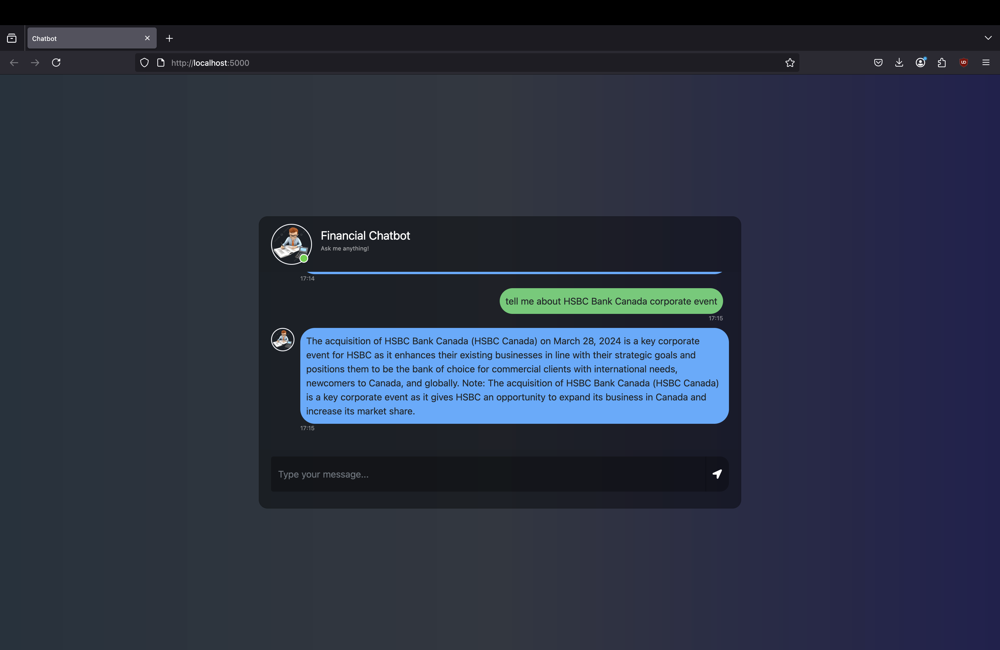

# Medical-Chatbot-Llama2  
End-to-end finance chatbot using Meta Llama2  

---

## Steps to Run the Project  

### 1. Clone this repository:  
```bash
git clone https://github.com/arrshsh/Medical-Chatbot-Llama2.git
cd Medical-Chatbot-Llama2
```

### 2. Set up Conda environment
```bash
conda create -n mchatbot python=3.8 -y
conda activate chatbot
```

### 3. Install dependencies
```bash
pip install -r requirements.txt
```

### 4. Configure .env
Create a .env file in the root directory and add these:
PINECONE_API_KEY="your_api_key_here"
PINECONE_API_ENV="your_env_here"

### 5. Downlaod the Llama2 model and place it in model/ folder
Follow this link: 
```bash 
https://huggingface.co/TheBloke/Llama-2-7B-Chat-GGML/tree/main
```

### 6. Generate Pinecone index:
```bash
python store_index.py
```

### 7. Launch the Flask app:
```bash
python app.py
```

### 8. Open localhost:5000 in your browser

  

## Tech Stack:
- Python
- LangChain
- Flask
- Meta Llama2
- Pinecone
